# Matrix Vobler (RU)

*English version below*

## Установка приложения

Чтобы использовать Матрикс необходимо установить клиентское приложение. Ниже привидены ссылки на скачивание приложения Element X для различных платформ.

### Windows
- [Скачать Element](https://element.io/en/download) (*если сайт не открывается, стоит попробовать включить VPN*)

### Android
- [Скачать Element X на Google Play](https://play.google.com/store/apps/details?id=io.element.android.x)
- [Скачать Element X на F-Droid](https://f-droid.org/packages/io.element.android.x/)

### IOS
- [Скачать Element X](https://apps.apple.com/us/app/element-x-secure-chat-call/id1631335820)

### MacOS
- [Скачать Element](https://element.io/en/download) (*если сайт не открывается, стоит попробовать включить VPN*)

### Linux
- [Скачать Element](https://element.io/en/download) (*если сайт не открывается, стоит попробовать включить VPN*)

## Регистрация аккаунта

*Это пример регистрации аккаунта с подробным описанием шагов для приложения Element X*

1. Откройте приложение **Element X**.
2. Нажмите на кнопку **"Создать аккаунт"** (Create account). (*кнопка, которую нужно нажать выделена красным прямоугольником*)

    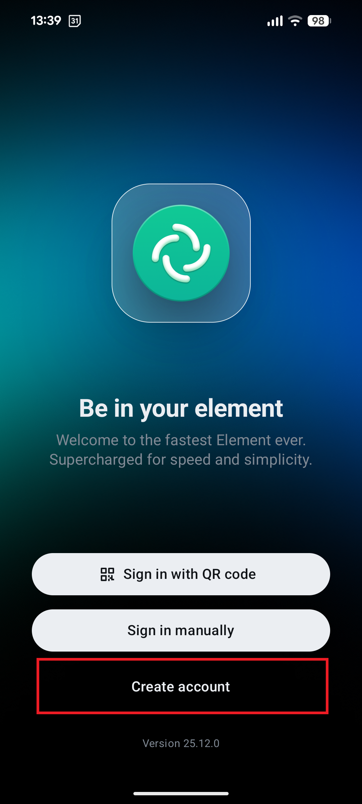

3. Нажмите на кнопку **"Поменять провайдера аккаунта"** (Change account provider).

    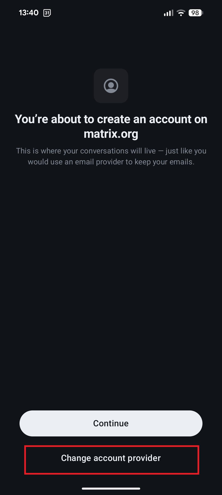

4. Выберите пункт **"Другой"** (Other).

    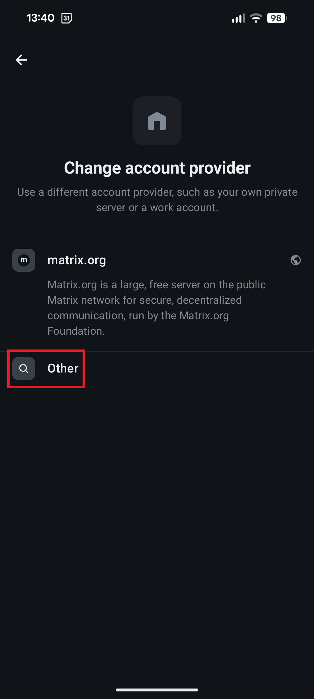

5. Введите адрес сервера **точно так, как написано ниже (можно скопировать и вставить)**:
```
matrix.vobler-tech.space:4444
```
(*поле ввода, в которое необходимо написать адрес сервера выделено красным прямоугольником*)

    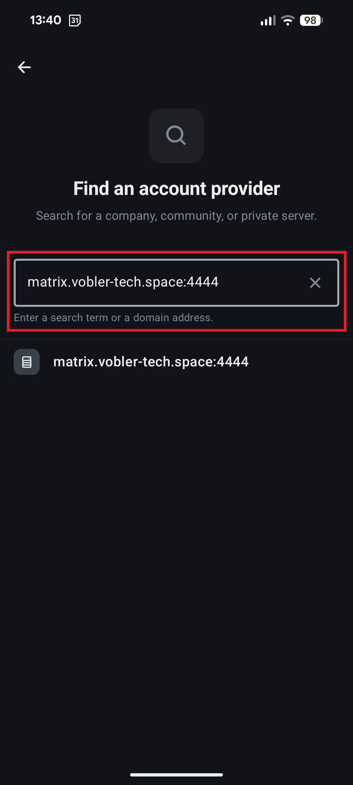

6. Нажмите на появившийся сервер в списке.

    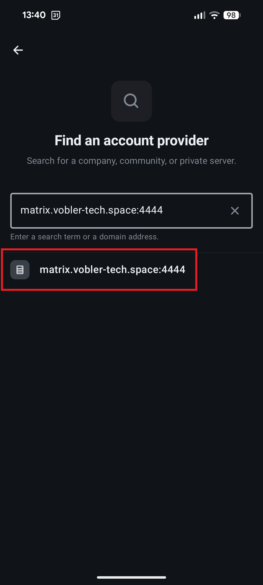

7. Нажмите на кнопку **"Продолжить"** (Continue).

    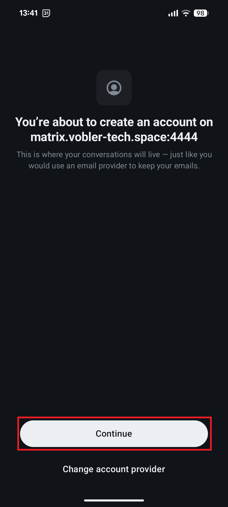

8. Заполните поля для регистрации аккаунта:

    ***⚠️ВНИМАНИЕ! Если вы забудете пароль от вашего аккаунта его будет НЕВОЗМОЖНО восстановить (вообще никак). Запишите пароль и храните его в надёжном месте.***
    - Имя пользователя (Username) - можно придумать любое, не обязательно настоящее имя
    - Пароль (Password)
    - Подтверждение пароля (Confirm password)

    И нажмите на кнопку **"Продолжить"** (Continue).

    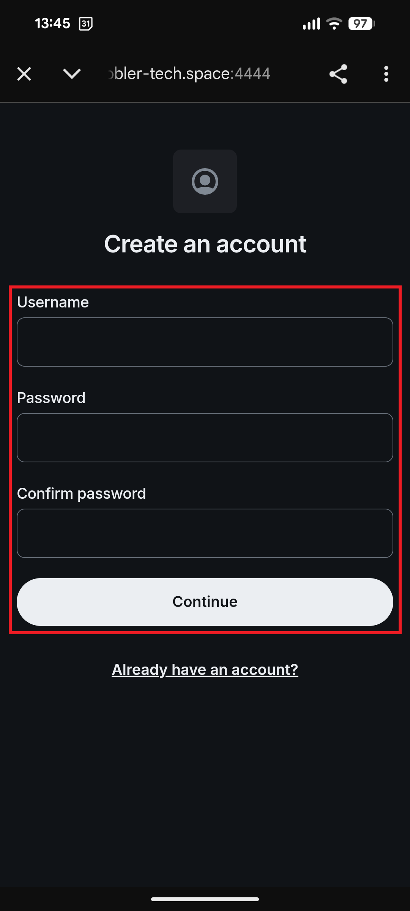

9. Нажмите на кнопку **"Невозможно подтвердить"** (Can't confirm).

    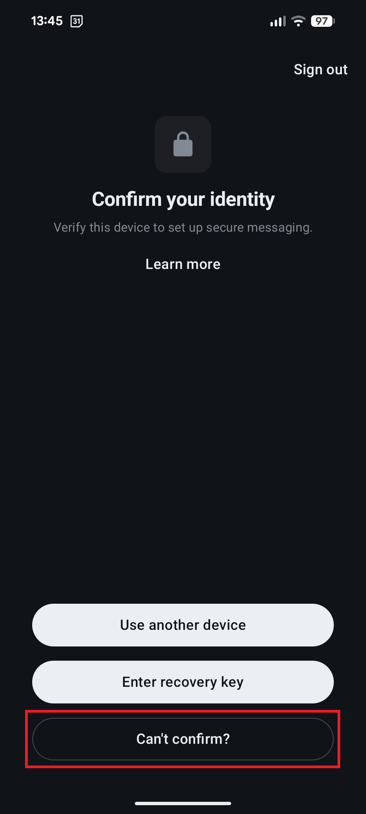

## Получение ключа восстановления

***Без ключа восстановления вы можете потерять доступ к вашим сообщенияем.Если ключ восстановления утерян и нет хотя бы одной активной сессии, доступ к старым сообщениям будет утрачен БЕЗВОЗВРАТНО.***


После успешной регсистрации аккаунта необходимо сохранить ключ восстановления аккаунта. Этот шаг **обязателен**. Без него можно потерять доступ к сообщениям.

1. Нажмите на **иконку профиля в левом верхнем углу**.

    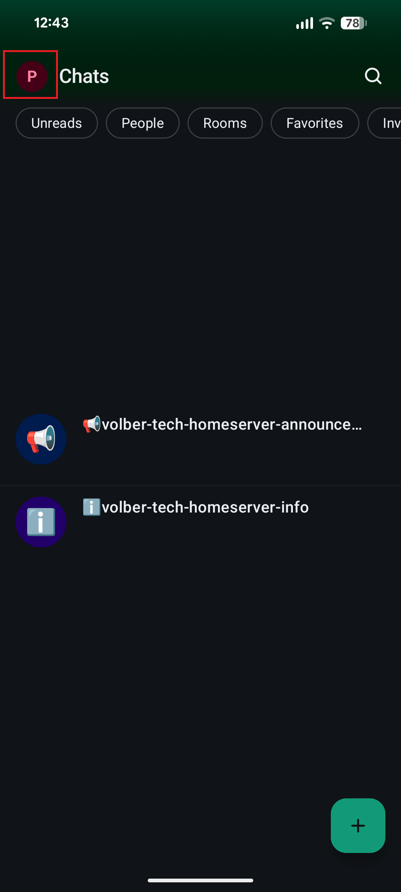

2. Нажмите на кнопку **"Шифрование"** (Encryption).

    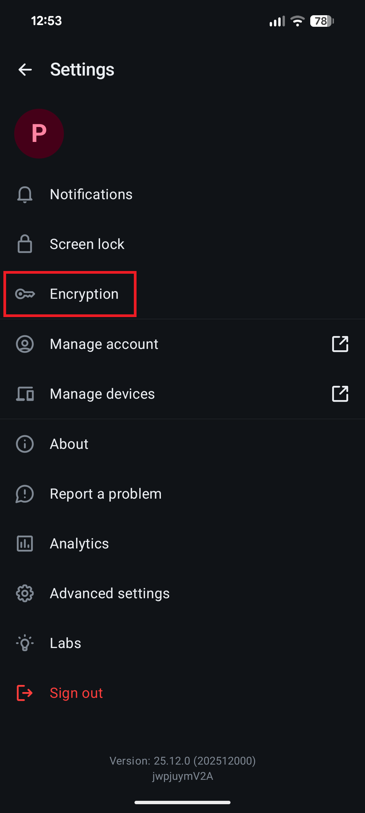

3. Нажмите на кнопку **"Изменить ключ восстановления"** (Change recovery key) или "Создать ключ восстановления" (Create recovery key).

    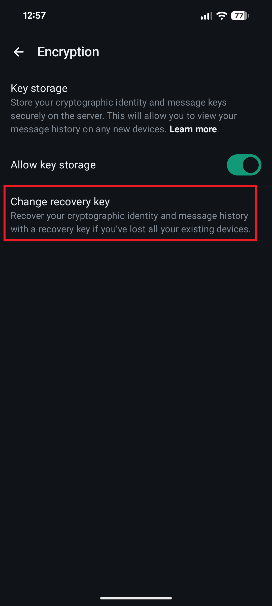

4. Следуйте инструкциям приложения, **запишите ключ восстановления в надежном месте**, желательно храните его на бумаге.

# Matrix Vobler (EN)

***TODO***
